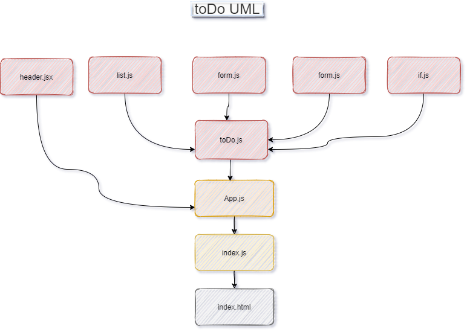

# ToDo

Todo is cloud-based task management application. It allows users to manage their tasks
## Author: As-har Abuhelweh

* [Deployment](https://60ddfa25586bab14049cc7e9--gallant-mayer-c2fc54.netlify.app/)

* [Pull Request](https://github.com/asharabuhelweh/todo/pull/1)

## Run the app
* npm install
* npm start

## UML

